# [📈 Live Status](https://AnimalEquality.github.io/upptime): <!--live status--> **🟩 All systems operational**

This repository contains the open-source uptime monitor and status page for [Animal Equality](https://AnimalEquality.github.io/upptime), powered by [Upptime](https://github.com/upptime/upptime).

With [Upptime](https://upptime.js.org), you can get your own unlimited and free uptime monitor and status page, powered entirely by a GitHub repository. We use [Issues](https://github.com/AnimalEquality/upptime/issues) as incident reports, [Actions](https://github.com/AnimalEquality/upptime/actions) as uptime monitors, and [Pages](https://AnimalEquality.github.io/upptime) for the status page.

<!--start: status pages-->
<!-- This summary is generated by Upptime (https://github.com/upptime/upptime) -->
<!-- Do not edit this manually, your changes will be overwritten -->
<!-- prettier-ignore -->
| URL | Status | History | Response Time | Uptime |
| --- | ------ | ------- | ------------- | ------ |
|  [US](https://animalequality.org/) | 🟩 Up | [us.yml](https://github.com/AnimalEquality/upptime/commits/HEAD/history/us.yml) | 

 336ms
     
 | 

<a href="https://AnimalEquality.github.io/upptime/history/us">100.00%</a>
    

|  [BR](https://animalequality.org.br/) | 🟩 Up | [br.yml](https://github.com/AnimalEquality/upptime/commits/HEAD/history/br.yml) | 

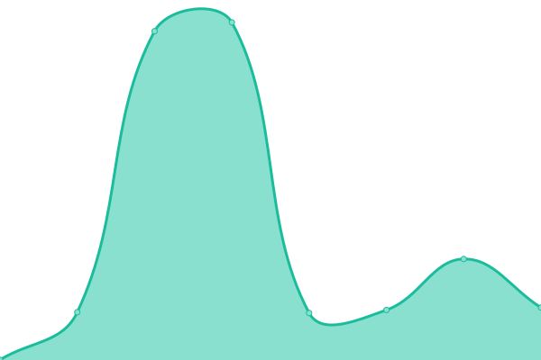 319ms
     
 | 

<a href="https://AnimalEquality.github.io/upptime/history/br">100.00%</a>
    

|  [DE](https://animalequality.de/) | 🟩 Up | [de.yml](https://github.com/AnimalEquality/upptime/commits/HEAD/history/de.yml) | 

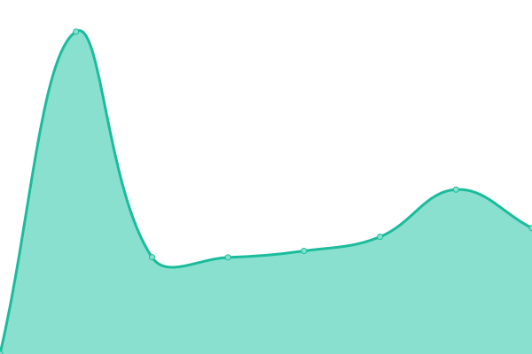 649ms
     
 | 

<a href="https://AnimalEquality.github.io/upptime/history/de">100.00%</a>
    

|  [ES](https://igualdadanimal.org/) | 🟩 Up | [es.yml](https://github.com/AnimalEquality/upptime/commits/HEAD/history/es.yml) | 

 757ms
     
 | 

<a href="https://AnimalEquality.github.io/upptime/history/es">100.00%</a>
    

|  [IN](https://animalequality.in/) | 🟩 Up | [in.yml](https://github.com/AnimalEquality/upptime/commits/HEAD/history/in.yml) | 

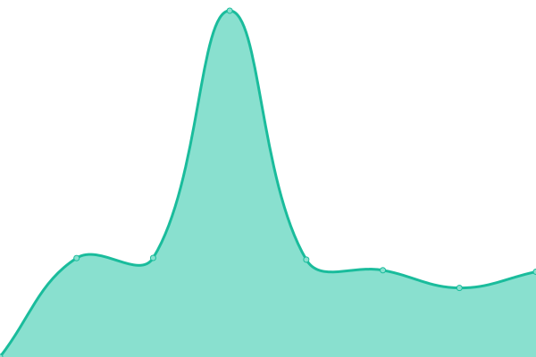 1165ms
     
 | 

<a href="https://AnimalEquality.github.io/upptime/history/in">99.67%</a>
    

|  [IT](https://animalequality.it/) | 🟩 Up | [it.yml](https://github.com/AnimalEquality/upptime/commits/HEAD/history/it.yml) | 

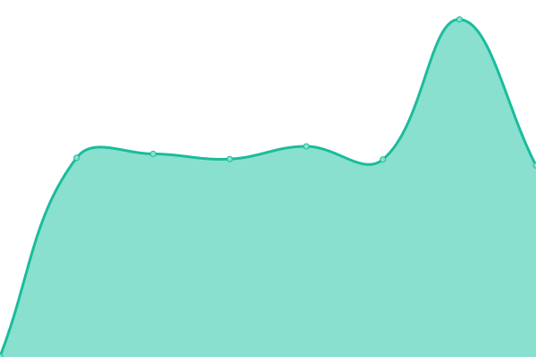 5619ms
     
 | 

<a href="https://AnimalEquality.github.io/upptime/history/it">99.08%</a>
    

|  [MX](https://igualdadanimal.org/) | 🟩 Up | [mx.yml](https://github.com/AnimalEquality/upptime/commits/HEAD/history/mx.yml) | 

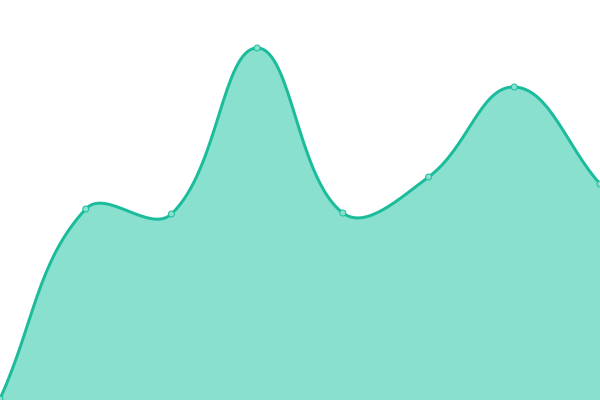 246ms
     
 | 

<a href="https://AnimalEquality.github.io/upptime/history/mx">100.00%</a>
    

|  [UK](https://animalequality.org.uk/) | 🟩 Up | [uk.yml](https://github.com/AnimalEquality/upptime/commits/HEAD/history/uk.yml) | 

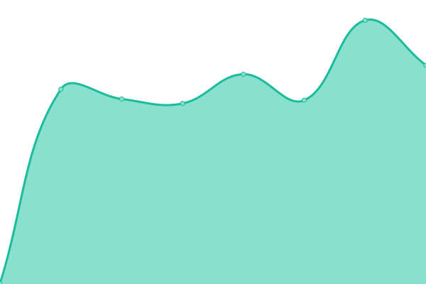 517ms
     
 | 

<a href="https://AnimalEquality.github.io/upptime/history/uk">100.00%</a>
    

|  [Investigations US](https://animalequality.org/action/babyhell) | 🟩 Up | [investigations-us.yml](https://github.com/AnimalEquality/upptime/commits/HEAD/history/investigations-us.yml) | 

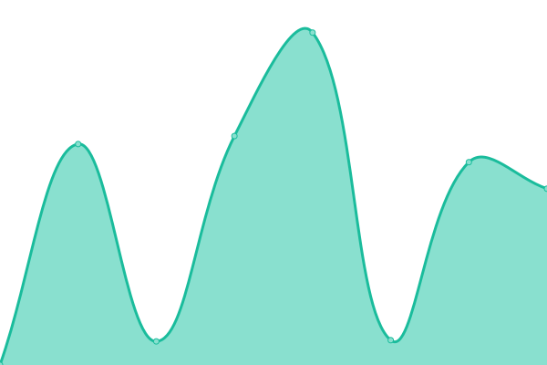 182ms
     
 | 

<a href="https://AnimalEquality.github.io/upptime/history/investigations-us">100.00%</a>
    

|  [Investigations BR](https://animalequality.org.br/participe/stopfoiegras) | 🟩 Up | [investigations-br.yml](https://github.com/AnimalEquality/upptime/commits/HEAD/history/investigations-br.yml) | 

 224ms
     
 | 

<a href="https://AnimalEquality.github.io/upptime/history/investigations-br">100.00%</a>
    

|  [Investigations DE](https://animalequality.de/kampagnen/gadhimai) | 🟩 Up | [investigations-de.yml](https://github.com/AnimalEquality/upptime/commits/HEAD/history/investigations-de.yml) | 

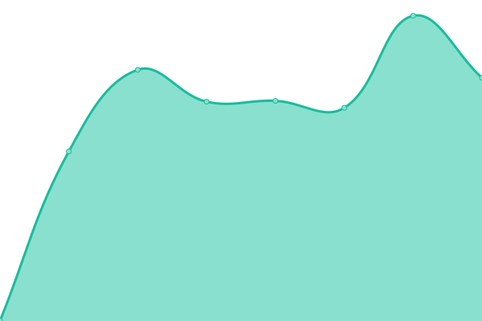 510ms
     
 | 

<a href="https://AnimalEquality.github.io/upptime/history/investigations-de">100.00%</a>
    

|  [Investigations ES](https://igualdadanimal.org/actua/mataderos) | 🟩 Up | [investigations-es.yml](https://github.com/AnimalEquality/upptime/commits/HEAD/history/investigations-es.yml) | 

 490ms
     
 | 

<a href="https://AnimalEquality.github.io/upptime/history/investigations-es">100.00%</a>
    

|  [Investigations IN](https://animalequality.in/action/prosecute-buffalo-abusers) | 🟩 Up | [investigations-in.yml](https://github.com/AnimalEquality/upptime/commits/HEAD/history/investigations-in.yml) | 

 1107ms
     
 | 

<a href="https://AnimalEquality.github.io/upptime/history/investigations-in">99.68%</a>
    

|  [Investigations IT](https://animalequality.it/agisci/supermercati-contro-gabbie) | 🟩 Up | [investigations-it.yml](https://github.com/AnimalEquality/upptime/commits/HEAD/history/investigations-it.yml) | 

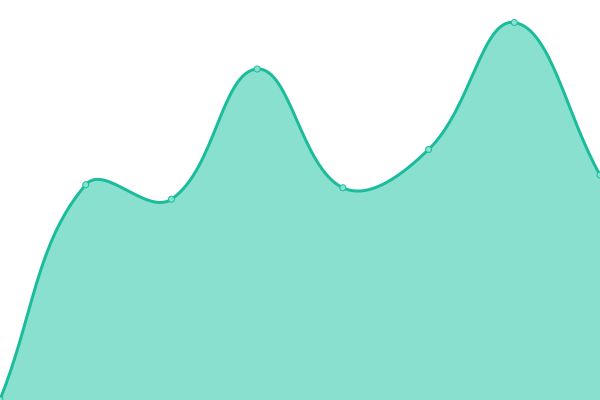 498ms
     
 | 

<a href="https://AnimalEquality.github.io/upptime/history/investigations-it">100.00%</a>
    

|  [Investigations MX](https://igualdadanimal.mx/actua/mision-sin-jaulas) | 🟩 Up | [investigations-mx.yml](https://github.com/AnimalEquality/upptime/commits/HEAD/history/investigations-mx.yml) | 

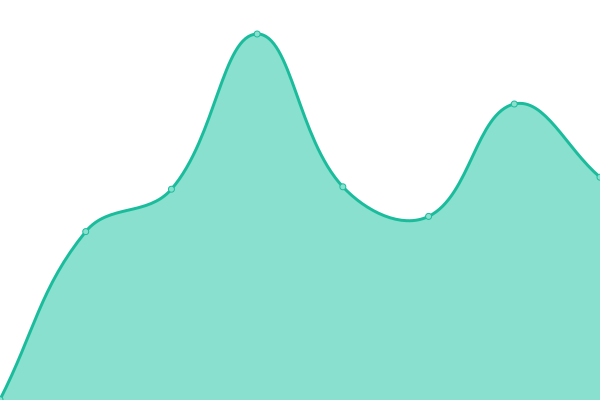 246ms
     
 | 

<a href="https://AnimalEquality.github.io/upptime/history/investigations-mx">100.00%</a>
    

|  [Investigations UK](https://animalequality.org.uk/act/ban-force-feeding) | 🟩 Up | [investigations-uk.yml](https://github.com/AnimalEquality/upptime/commits/HEAD/history/investigations-uk.yml) | 

 495ms
     
 | 

<a href="https://AnimalEquality.github.io/upptime/history/investigations-uk">100.00%</a>
    

|  [LoveVeg US](https://loveveg.com/) | 🟩 Up | [love-veg-us.yml](https://github.com/AnimalEquality/upptime/commits/HEAD/history/love-veg-us.yml) | 

 250ms
     
 | 

<a href="https://AnimalEquality.github.io/upptime/history/love-veg-us">100.00%</a>
    

|  [LoveVeg BR](https://loveveg.com.br) | 🟩 Up | [love-veg-br.yml](https://github.com/AnimalEquality/upptime/commits/HEAD/history/love-veg-br.yml) | 

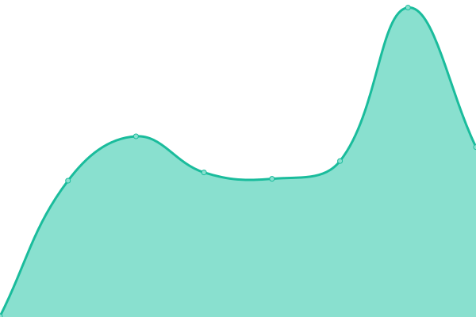 372ms
     
 | 

<a href="https://AnimalEquality.github.io/upptime/history/love-veg-br">100.00%</a>
    

|  [LoveVeg DE](https://loveveg.de) | 🟩 Up | [love-veg-de.yml](https://github.com/AnimalEquality/upptime/commits/HEAD/history/love-veg-de.yml) | 

 658ms
     
 | 

<a href="https://AnimalEquality.github.io/upptime/history/love-veg-de">100.00%</a>
    

|  [LoveVeg ES](https://es.loveveg.com) | 🟩 Up | [love-veg-es.yml](https://github.com/AnimalEquality/upptime/commits/HEAD/history/love-veg-es.yml) | 

 580ms
     
 | 

<a href="https://AnimalEquality.github.io/upptime/history/love-veg-es">100.00%</a>
    

|  [LoveVeg IN](https://loveveg.in) | 🟩 Up | [love-veg-in.yml](https://github.com/AnimalEquality/upptime/commits/HEAD/history/love-veg-in.yml) | 

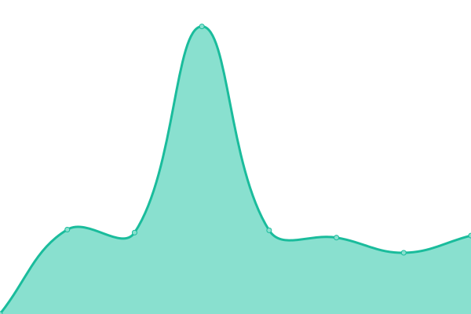 3169ms
     
 | 

<a href="https://AnimalEquality.github.io/upptime/history/love-veg-in">99.78%</a>
    

|  [LoveVeg IT](https://it.loveveg.com/) | 🟩 Up | [love-veg-it.yml](https://github.com/AnimalEquality/upptime/commits/HEAD/history/love-veg-it.yml) | 

 526ms
     
 | 

<a href="https://AnimalEquality.github.io/upptime/history/love-veg-it">100.00%</a>
    

|  [LoveVeg MX](https://loveveg.mx/) | 🟩 Up | [love-veg-mx.yml](https://github.com/AnimalEquality/upptime/commits/HEAD/history/love-veg-mx.yml) | 

 229ms
     
 | 

<a href="https://AnimalEquality.github.io/upptime/history/love-veg-mx">100.00%</a>
    

|  [LoveVeg UK](https://loveveg.uk/) | 🟩 Up | [love-veg-uk.yml](https://github.com/AnimalEquality/upptime/commits/HEAD/history/love-veg-uk.yml) | 

 493ms
     
 | 

<a href="https://AnimalEquality.github.io/upptime/history/love-veg-uk">100.00%</a>
    

|  [Campaign IT](https://campaigns.animalequality.it/senza-sosta/) | 🟩 Up | [campaign-it.yml](https://github.com/AnimalEquality/upptime/commits/HEAD/history/campaign-it.yml) | 

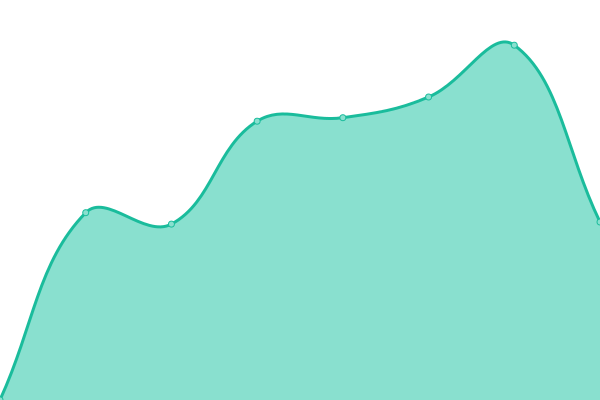 2431ms
     
 | 

<a href="https://AnimalEquality.github.io/upptime/history/campaign-it">99.95%</a>
    

|  [Donation ES](https://igualdadanimal.org/dona/) | 🟩 Up | [donation-es.yml](https://github.com/AnimalEquality/upptime/commits/HEAD/history/donation-es.yml) | 

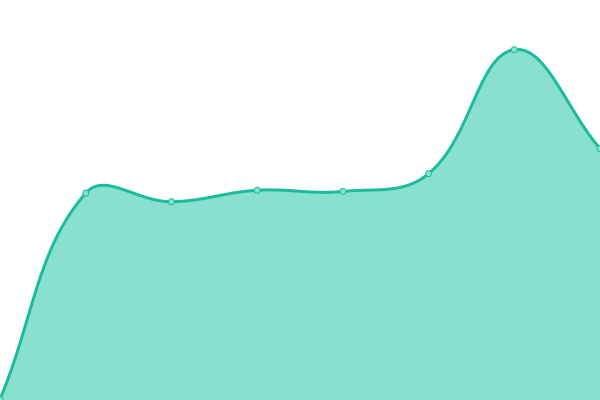 469ms
     
 | 

<a href="https://AnimalEquality.github.io/upptime/history/donation-es">100.00%</a>
    

|  [MacDo US](https://truthaboutmcdonaldschicken.com/) | 🟩 Up | [mac-do-us.yml](https://github.com/AnimalEquality/upptime/commits/HEAD/history/mac-do-us.yml) | 

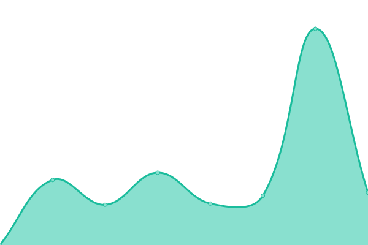 208ms
     
 | 

<a href="https://AnimalEquality.github.io/upptime/history/mac-do-us">100.00%</a>
    

|  Cygne | 🟩 Up | [cygne.yml](https://github.com/AnimalEquality/upptime/commits/HEAD/history/cygne.yml) | 

 486ms
     
 | 

<a href="https://AnimalEquality.github.io/upptime/history/cygne">100.00%</a>
    

|  [Corporate Progress](https://corporatesocialresponsibility.us/) | 🟩 Up | [corporate-progress.yml](https://github.com/AnimalEquality/upptime/commits/HEAD/history/corporate-progress.yml) | 

 684ms
     
 | 

<a href="https://AnimalEquality.github.io/upptime/history/corporate-progress">100.00%</a>
    

|  [DotNet redirect](https://www.animalequality.net) | 🟩 Up | [dot-net-redirect.yml](https://github.com/AnimalEquality/upptime/commits/HEAD/history/dot-net-redirect.yml) | 

 655ms
     
 | 

<a href="https://AnimalEquality.github.io/upptime/history/dot-net-redirect">100.00%</a>
    

|  Etalon | 🟩 Up | [etalon.yml](https://github.com/AnimalEquality/upptime/commits/HEAD/history/etalon.yml) | 

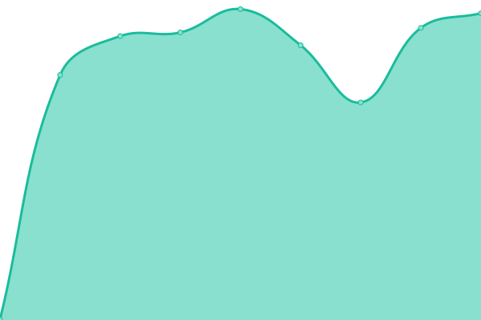 592ms
     
 | 

<a href="https://AnimalEquality.github.io/upptime/history/etalon">100.00%</a>
    

|  [VoiceLessFriends](https://voicelessfriends.org/) | 🟩 Up | [voice-less-friends.yml](https://github.com/AnimalEquality/upptime/commits/HEAD/history/voice-less-friends.yml) | 

 2712ms
     
 | 

<a href="https://AnimalEquality.github.io/upptime/history/voice-less-friends">100.00%</a>
    

<!--end: status pages-->

[**Visit our status website →**](https://AnimalEquality.github.io/upptime)

## 📄 License

- Powered by: [Upptime](https://github.com/upptime/upptime)
- Code: [MIT](./LICENSE) © [Animal Equality](https://AnimalEquality.github.io/upptime)
- Data in the `./history` directory: [Open Database License](https://opendatacommons.org/licenses/odbl/1-0/)
